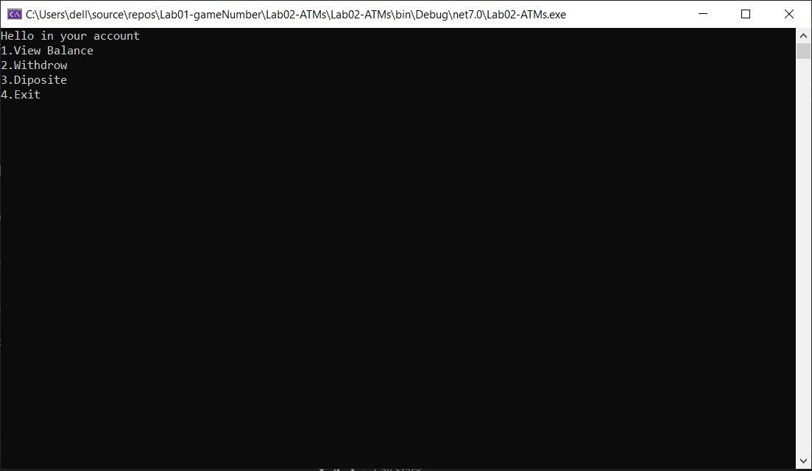

# ATM
Summary:
The provided code is a simple implementation of an ATM (Automated Teller Machine) program. It allows users to interact with their account by performing actions such as viewing the account balance, withdrawing money, and depositing money. The code utilizes a console-based user interface to prompt the user for actions and display relevant information.

# Visuals:
As the code is a console application, there are no visual elements to show. The interactions and outputs are displayed in the console window.

# Step-by-step directions (walk-through):
To use the ATM program, follow these steps:
 - Run the program.
 - The console window will display a greeting message.
 - The available options will be listed:
   - View Balance: Shows the current account balance.
   - Withdraw: Allows you to withdraw a specified amount from the account.
   - Deposit: Lets you deposit a specified amount into the account.
   - Exit: Exits the program.
- Enter the corresponding number for the action you want to perform:

For example, if you want to view the balance, enter 1 and press Enter.
The program will execute the selected action and display the corresponding information or prompt you for additional input if necessary.
You can repeat the process by selecting another action until you choose to exit by entering 4.

# Other relevant details:
The code uses the decimal data type for handling financial values to ensure accuracy in calculations involving money.
The initial account balance is set to 1000 in the balance variable.
The code includes basic error handling to prevent certain actions, such as withdrawing a higher amount than the account balance or depositing a negative amount.
It's important to note that this code is a simplified demonstration and may not cover all possible scenarios or edge cases that would be required in a production-ready ATM system.

